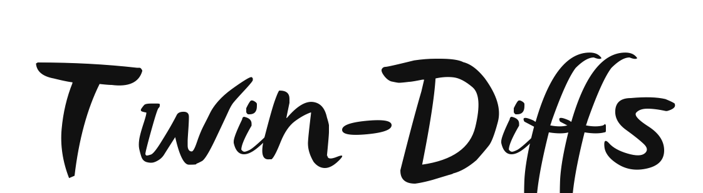

<p align="center" width="100%">

</p>


### Twin-Diffs: A Novel Method for 3D Reconstruction of Blast Furnace Burden Surface

- [x] Implement Twin-Diffs on [diffusers](https://github.com/huggingface/diffusers) (training && inference).
- [x] Release the results.
- [ ] Release the weights trained on Blast Furnace Burden Surface Dataset.
- [ ] Release the data processing scripts.
- [ ] Hugging Face live demo.


### NEWS
- We implement an initial version of Twin-Diffs on diffusers.
- Data, weights, and a more detailed document are coming.

### Quantities of Results.

<p align="center" width="100%">

</p>

### Getting Started
Twin-Diffs can be trained with only 8 A100 GPUs. The code is tested on torch 2.0.0 and cuda 11.8. Data and weights will be uploaded to [here](https://drive.google.com/drive/folders/1bfszAMyQgVFs6JGA1pIlPz_ym-kB_rrI?usp=sharing).
```sh
# cuda 11.8 torch 2.0.0 diffusers origin 0.18.0.dev0
pip install -e ".[torch]"
pip install git+https://github.com/NVlabs/nvdiffrast/
pip install kaolin==0.15.0 -f https://nvidia-kaolin.s3.us-east-2.amazonaws.com/torch-2.0.0_cu118.html
sudo apt-get install libsparsehash-dev
pip install --upgrade git+https://github.com/mit-han-lab/torchsparse.git@v1.4.0
pip install imageio trimesh tqdm matplotlib torch_scatter ninja einops
pip install -r requirements.txt
```


### Train 
We provide a sh file for training. Please modify parameters and gpus in it.
```bash
bash train.sh
```

### Inference
If you want to implement inference, please modify the configure file `conf/base.yaml`

## Acknowledgement
We thank the following authors for their excellent works!
- [Stable Diffusion](https://github.com/CompVis/stable-diffusion)
- [Gaussian Splatting](https://github.com/graphdeco-inria/gaussian-splatting)
- [BiDiff](https://github.com/BiDiff/BiDiff)
- [GSGEN](https://github.com/gsgen3d/gsgen)

